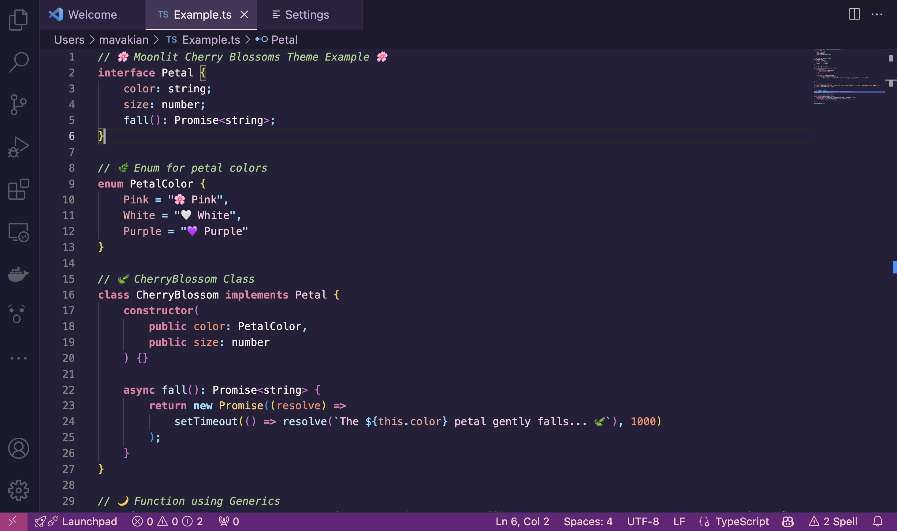

# Moonlit Cherry Blossoms VSCode Theme
Welcome! This VSCode UI theme features relaxing purples, pastel pinks and greens, and soft blues. It was made to make your coding environment cuter. 

## Features
🌙 **Aesthetic Dark Mode** – A soothing, moonlit-inspired dark theme with gentle contrast.  
🌸 **Cherry Blossom Accents** – Soft pinks, lavenders, and gentle blues for a relaxing workspace.  
🎨 **Custom Syntax Highlighting** – Carefully chosen colors for keywords, variables, and functions for clarity.  
🖼 **Styled UI Components** – Matching sidebar, status bar, and tab colors for a consistent look.  
💖 **Easy on the Eyes** – Designed to reduce strain during long coding sessions.  
🌌 **Supports Multiple Languages** – Works beautifully with JavaScript, Python, HTML, CSS, and more.  

## Preview

## Installation  
1. Search **`Moonlit Cherry Blossoms`** in VSCode Extension Marketplace.  
2. Install the theme and reload your VSCode.  
3. Press **F1**, search `"Preferences: Color Theme"`, and select **Moonlit Cherry Blossoms**.  

## 📝 Issues and Suggestions  
For any issues or suggestions, please visit the **[GitHub Issues](https://github.com/makenna-avakian/sakura-trees)** page and let me know!  

Enjoy your dreamy coding experience! 🌸✨  